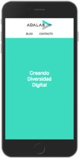
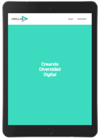
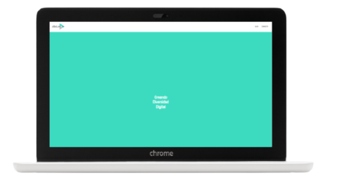

  

# **Adalab Landing Page**

## **About**

Half module 1 project of the Adalab Digital Frontend Development Bootcamp.

This is a responsive landing page developed with [](https://html.spec.whatwg.org/) and [](https://www.w3.org/Style/CSS/)

## **Quick start guide**

Instructions to start this project:

### Installation

- Clone repository:

```
git clone [repository]
```

- Run project on local server with VSCode live server plugin.

- [**Project URL**](https://anaguerraabaroa.github.io/adalab-landing-page/) is also available on GitHub Pages.

## **Features**

- HTML semantic elements
- Fixed header with a logo and a inline navigation menu
- Main section with a background color and centered title
- Responsive web design for mobile and tablet/desktop devices
- Rubik typography and defined colors palette

## **Folder Structure**

```
Adalab Landing Page
├── images
│   ├── adalab-logo-155x61.png
│   ├── landing_desktop.png
│   ├── landing_mobile.png
│   └── landing_tablet.png
├── styles
│   └── main.css
├── index.html
├── LICENSE
└── README.md
```

## **License**

This project is licensed under 
