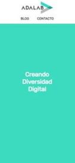
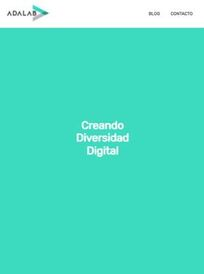

# **AdalabLandingPage**

Half module 1 exercise of the Adalab Digital Frontend Development Bootcamp.

This is a responsive landing page developed with HTML5 and CSS3.

## **Installation**

Clone repository and open project on a browser with VSCode live server plugin.

Project **[URL](https://anaguerraabaroa.github.io/AdalabLandingPage/)** is also available on GitHub Pages.

## **Development technologies**

- [**HTML5**](https://html.spec.whatwg.org/)
- [**CSS3**](https://www.w3.org/Style/CSS/)

## **Exercise development requirements**

- HTML semantic elements
- Fixed header with a logo and a inline navigation menu
- Main section with a background color and centered title
- Responsive web design for mobile and tablet/desktop devices
- Rubik typography and defined colors palette

## **Folder Structure**

```
AdalabLandingPage
├── images
│   └── adalab-logo-155x61.png
├── styles
│   └── main.css
├── index.html
└── readme.md
```

## **Deployment**

```
git add -A
git commit -m "Message commit"
git push
```

## **Result**

 
